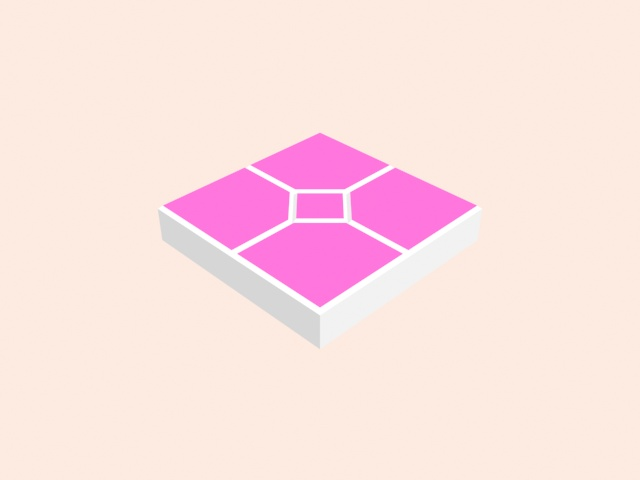

# 3d model floor

## Feats

- curd object
- curd mat
- curd ms

## Demos



[get more demo](./note/demo-more.jpg)
## how to use with production?

### install
```sh
# get the code

# use .fbx file , .max file ...

```

## how to use with developmet?


## Author

yemiancheng <ymc-github@gmail.com>

## License

MIT
